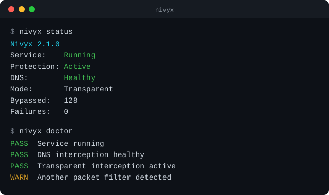

<p align="center">
  
</p>

<h3 align="center">Lightweight system-wide DPI bypass.</h3>
<p align="center">Linux &middot; Windows &middot; macOS</p>

<p align="center">
  <a href="https://github.com/kadireren7/nivyx/actions/workflows/build.yml"></a>
  <a href="https://github.com/kadireren7/nivyx/releases"></a>
  <a href="LICENSE"></a>
  
</p>

Nivyx gets HTTPS traffic past SNI-based DPI (deep packet inspection)
filtering. On Linux (and, in beta, on Windows and macOS) it runs as a
system service: after one install, blocked sites and apps work in
every browser and application — **automatic and system-wide, with no
manual proxy configuration and no manual DNS configuration**.

It runs entirely on your own machine. It is **not a VPN**, it does not
tunnel through a remote server, and it never decrypts or
man-in-the-middles TLS.

## Platforms

| Platform | What you get | Validation |
|---|---|---|
| Linux | **Transparent automatic mode** | Real ISP/DPI field-tested |
| Windows 10/11 (x64) | **Transparent automatic mode (Beta)** | Real ISP/DPI field-tested |
| macOS (Apple silicon, Intel) | **Transparent automatic mode (Beta)** | Real ISP/DPI field-tested |

`nivyx doctor` (or `dpi-proxy --capabilities`) prints what your
install supports.

## Install

**Linux:**

1. Clone the repository.
2. Run `sudo ./scripts/install.sh`.

Guide: [docs/linux.md](docs/linux.md).

**Windows (Beta):**

1. Download the Windows release ZIP.
2. Extract it.
3. Double-click `Install Nivyx.cmd` (accept the UAC prompt).

Guide: [docs/windows.md](docs/windows.md).

**macOS (Beta):**

1. Download the matching macOS release ZIP (Apple silicon or Intel).
2. Extract it.
3. Double-click `Install Nivyx.command` (enter your password when asked).

Guide: [docs/macos.md](docs/macos.md).

Each installer builds/checks the service, verifies DNS and HTTPS
through it, and enables it at boot — nothing to configure afterwards.
Before installing, stop other DPI tools or VPN packet filters
(`nivyx doctor` after install checks for the ones it can detect).

## Usage

The same `nivyx` commands work on every platform (`start`/`stop`/
`restart`/`reload` need root/Administrator):

```
$ nivyx status
Nivyx 2.1.0
Service:    Running
Protection: Active
DNS:        Healthy
Mode:       Transparent
Bypassed:   128
Failures:   0

$ nivyx doctor
PASS  Service running
PASS  DNS interception healthy
PASS  Transparent interception active
WARN  Another packet filter detected
```

<p align="center">
  
</p>

```
nivyx status                # short summary
nivyx status --verbose      # full detail
nivyx doctor                # health checks (PASS/WARN/FAIL)
nivyx diagnose discord.com  # DNS + HTTPS check for one site
nivyx logs 50
nivyx support-bundle        # local diagnostics archive, redacted, no telemetry
nivyx restart                # (root/Administrator)
nivyx stop                   # (root/Administrator) until next start/boot
```

`dpictl` and `dpi-proxy-ctl` still work with the same commands
(compatibility aliases from earlier releases). Full reference,
including exactly what `doctor` checks and what `support-bundle`
redacts: [docs/cli.md](docs/cli.md).

Output is colored on a terminal (green/yellow/red for
healthy/warning/failed) and plain when piped, redirected, or when
[`NO_COLOR`](https://no-color.org) is set.

Optional manual rules go in `strategy.conf` (e.g. `example.com =
tlsrec`); none are needed — known-blocked services get the bypass
automatically, other sites are tried directly first and only bypassed
if they need it.

## Limitations

- **Not a VPN.** Traffic leaves from your own connection with your own
  IP address. Sites blocked by IP address, or services that block your
  region, are not reachable this way.
- **HTTPS and DNS only.** Other UDP traffic — voice and video calls,
  game traffic — is not touched (e.g. Discord text and media work,
  voice may not).
- **Network-dependent.** DPI systems differ between ISPs and change
  over time; this bypasses DPI that inspects the TLS server name
  without reassembling TLS records, not every censorship system.
- **One interceptor at a time.** Don't run another transparent DPI
  tool (dpi-bypass, GoodbyeDPI, zapret, …) alongside it — `nivyx
  doctor` and the service itself warn if they detect one.
- **Windows and macOS are Beta**: end-to-end tested in CI on real
  runners, and field-tested against real ISP-level DPI on one physical
  Windows PC and one physical Mac respectively; not yet validated
  across a wide range of consumer hardware and networks. Platform-
  specific details and limitations: [docs/windows.md](docs/windows.md),
  [docs/macos.md](docs/macos.md).

## Uninstall

Linux: `sudo ./scripts/uninstall.sh` (details: [docs/linux.md](docs/linux.md)).
Windows: double-click `Uninstall Nivyx.cmd` (details: [docs/windows.md](docs/windows.md)).
macOS: double-click `Uninstall Nivyx.command` (details: [docs/macos.md](docs/macos.md)).

## Documentation

- [docs/cli.md](docs/cli.md) — full `nivyx` command reference.
- [docs/linux.md](docs/linux.md), [docs/windows.md](docs/windows.md),
  [docs/macos.md](docs/macos.md) — platform-specific install, commands,
  files, troubleshooting, and how each one touches the system
  (nftables / WinDivert / PF).
- [docs/transparent-mode.md](docs/transparent-mode.md) — how the
  engine works (all platforms): DNS, the decision ladder, fail-open,
  operation.
- [docs/development.md](docs/development.md) — building, tests,
  sanitizers, CI.
- [docs/performance.md](docs/performance.md) — package size breakdown
  and measured resource use, per platform.
- [docs/packet-mode.md](docs/packet-mode.md),
  [docs/architecture.md](docs/architecture.md),
  [docs/discovery.md](docs/discovery.md),
  [docs/network-profiles.md](docs/network-profiles.md) — the optional
  packet-mode engine (Linux, advanced).

## License

MIT — see [LICENSE](LICENSE).
